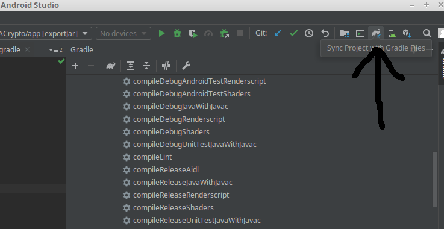
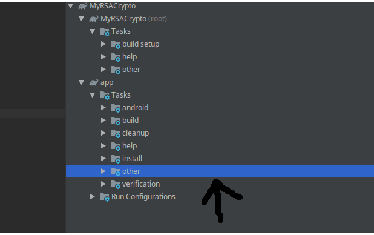
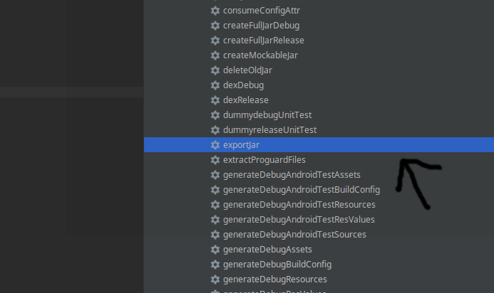

# android-nativescript-jar
The java code that will provide the jar file for our nativescript-rsa instance

## How to build the jar rsa library for nativescript
* 1st step: Install Android Studio.
* 2nd step: click to sync gradle script.

* 3rd step: click on app->Tasks->other->exportJar:

